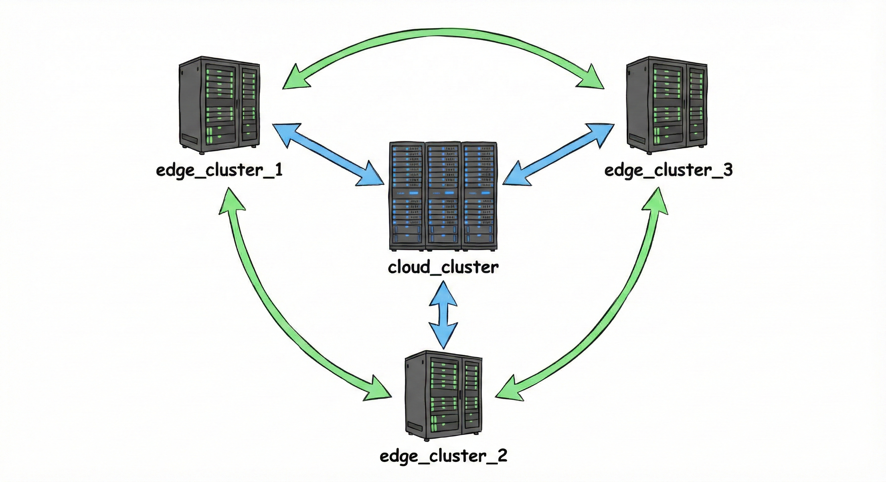
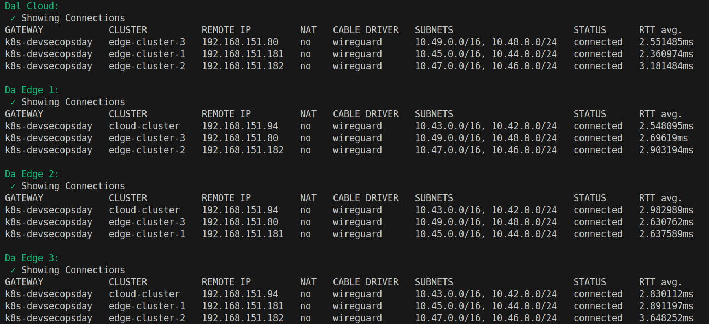
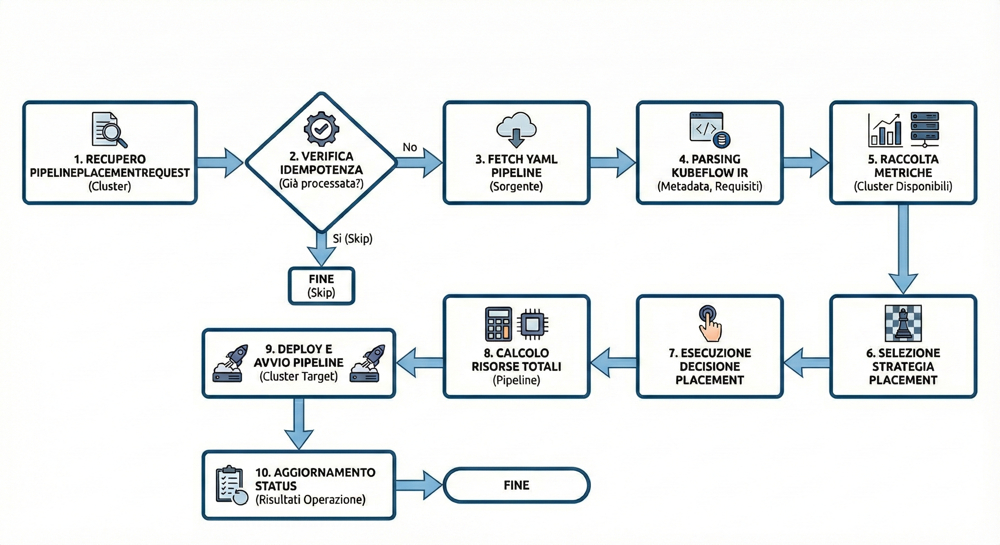
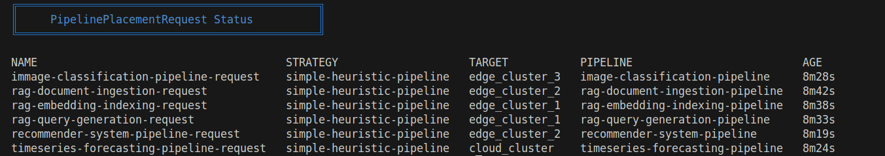
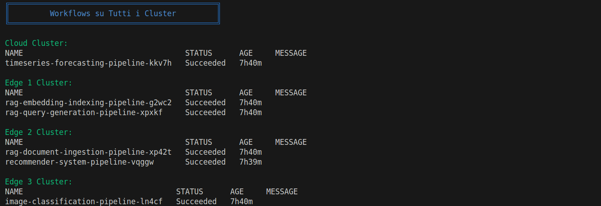
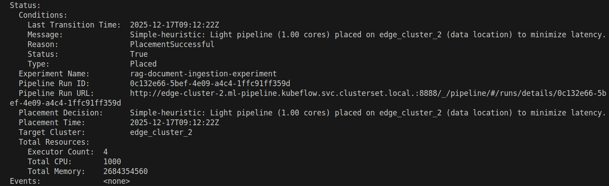
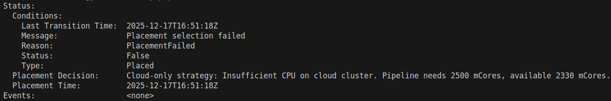
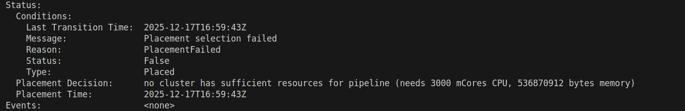

# Orchestratore multi-cluster

## Obiettivo
Realizzazione di un orchestratore per il posizionamento di workflow di machine learning (pipeline kubeflow) in un ambiente multicluster.

---

## Architettura del Sistema

L'ambiente multicluster è composto da 4 macchine virtuali single node:

* cloud_cluster
* edge_cluster_1
* edge_cluster_2
* edge_cluster_3



i quattro cluster possono comunicare tramite un' oportuna configurazione Submariner:



---

## CRD: PipelinePlacementRequest

L'utente interagisce con il sistema creando un file YAML di tipo `PipelinePlacementRequest`. Questa risorsa contiene tutte le istruzioni necessarie per l'orchestrazione.

Ecco la struttura dei campi principali (`Spec`):

| Campo | Descrizione |
| :--- | :--- |
| **`pipelineName`** | Il nome logico da assegnare alla pipeline. |
| **`pipelineSource`** | Da dove recuperare il codice della pipeline. Supporta `url` (download diretto), `inline` (YAML incollato direttamente) o `configmap`. |
| **`placementStrategy`** | La strategia decisionale da usare:<br>• `cloud-only-pipeline`: Forza l'esecuzione sul cloud centrale.<br>• `data-locality-pipeline`: Sceglie il cluster dove risiedono i dati.<br>• `simple-heuristic-pipeline`: Valuta risorse disponibili e la località del dato. |
| **`dataLocation`** | (Opzionale) Indica dove si trovano i dati (es. `edge_cluster_1`). Fondamentale per la strategia di data-locality. |
| **`parameters`** | (Opzionale) Mappa di parametri chiave-valore da passare alla pipeline Kubeflow. |

### Esempio di PipelinePlacementRequest
```yaml
apiVersion: orchestrator.cloudcontinuum.io/v1alpha1
kind: PipelinePlacementRequest
metadata:
  name: rag-embedding-indexing-request
  namespace: kubeflow
spec:
  pipelineName: "rag-embedding-indexing-pipeline"
  placementStrategy: "simple-heuristic-pipeline"
  dataLocation: "edge_cluster_1"
  experimentName: "rag-embedding-indexing-experiment"
  parameters:
    chunks_file: "/data/chunks_with_metadata.json"
    embedding_model: "all-MiniLM-L6-v2"
    index_type: "FAISS-IVF"
  pipelineSource:
    type: inline
    inline: |
        # PIPELINE DEFINITION
```

## Reconcile Loop

Il `Reconcile` è la funzione principale che caratterizza il controller. Viene eseguita automaticamente ogni volta che una risorsa `PipelinePlacementRequest` viene creata o modificata, con l'obiettivo di portare il sistema dallo stato attuale allo stato desiderato.



Il flusso logico si articola in **10 passaggi sequenziali**:

1.  **Recupero della Richiesta**: Il controller cerca nel cluster la risorsa `PipelinePlacementRequest` che ha scatenato l'evento. Se non la trova (es. è stata cancellata), termina l'esecuzione.
2.  **Verifica Idempotenza**: Controlla se la pipeline è già stata posizionata (`Status.TargetCluster` già valorizzato). In caso affermativo, interrompe l'elaborazione per evitare duplicazioni.
3.  **Fetch del Codice**: Scarica la definizione della pipeline (YAML) dalla sorgente specificata (URL, ConfigMap o Inline).
4.  **Analisi (Parsing)**: Analizza il file YAML (Kubeflow IR) per identificare il numero di executor (container) e i requisiti di risorse (CPU/Memoria).
5.  **Raccolta Metriche**: Interroga l'infrastruttura per ottenere i dati in tempo reale sulla CPU e Memoria disponibili su tutti i cluster (Cloud ed Edge).
6.  **Selezione Strategia**: Istanzia la logica decisionale corretta basandosi sul campo `spec.placementStrategy` (es. `cloud-only`, `data-locality`).
7.  **Decisione di Placement**: Incrocia i requisiti della pipeline (step 4) con le risorse disponibili (step 5) applicando la strategia scelta (step 6) per determinare il **Cluster Target**.
8.  **Calcolo Totale Risorse**: Aggrega tutte le risorse richieste per generare un report completo del carico di lavoro previsto.
9.  **Esecuzione su Kubeflow**: Contatta le API di Kubeflow sul cluster target selezionato, carica la pipeline e avvia una nuova Run.
10. **Aggiornamento Stato**: Aggiorna la risorsa Kubernetes registrando il cluster di destinazione, l'ID dell'esecuzione Kubeflow e la motivazione tecnica della decisione.

## Test
Sono state testate alcune richieste di PipelinePlacementRequest per testare il comportamento del controller.





Dopo che le PipelinePlacementRequest sono state applicate il controller ha eseguito le varie fasi descritte in precedenza ed in base alla strategia specficata ha deciso su quale cluster eseguire le pipeline kubeflow.


### Esempio: rag-document-ingestion-reqeust

Andiamo ad analizzare la PipelinePlacementRequest "rag-document-ingestion-reqeust".


```yaml
apiVersion: orchestrator.cloudcontinuum.io/v1alpha1
kind: PipelinePlacementRequest
metadata:
  name: rag-document-ingestion-request
  namespace: kubeflow
spec:
  pipelineName: "rag-document-ingestion-pipeline"
  placementStrategy: "simple-heuristic-pipeline"
  dataLocation: "edge_cluster_2"
  experimentName: "rag-document-ingestion-experiment"
  parameters:
    data_source: "/data/documents"
    chunk_size: "512"
    chunk_overlap: "50"
  pipelineSource:
    type: inline
```

### Strategia di Placement: Simple Heuristic
La strategia **simple-heuristic-pipeline** implementa una logica di decisione gerarchica basata su euristiche:

1. **GPU Check**: Se la pipeline richiede GPU => **forza cloud_cluster**
2. **Heavy Workload Check**: Se richiede >2 cores => **preferisce cloud_cluster**
3. **Data Locality + Light Workload**: Se <2 cores E `dataLocation` specificato => **preferisce edge vicino ai dati**
4. **Fallback**: Cluster con più risorse disponibili



### Analisi della Decisione

**Perché edge_cluster_2?**

1. **Pipeline Leggera**: 1.00 cores totali < soglia di 2.00 cores
   - Non necessita della potenza computazionale del cloud
   - Può essere eseguita efficacemente su edge con risorse limitate

2. **Data Locality Match**: `dataLocation: edge_cluster_2` specificato nel CRD
   - Zero data transfer necessario tra cluster
   - Minimizzazione della latenza di I/O

3. **Risorse Sufficienti**: edge_cluster_2 aveva disponibilità adeguata
   - CPU disponibile: >1000 mCores richiesti
   - Memory disponibile: >2.5 GB richiesti

### Esempio: PipelinePlacementRequest fallita
```yaml
apiVersion: orchestrator.cloudcontinuum.io/v1alpha1
kind: PipelinePlacementRequest
metadata:
  name: test-failure-cloud-request
  namespace: kubeflow
spec:
  pipelineName: "hello-cloud"
  placementStrategy: "cloud-only-pipeline"
  experimentName: "hello-cloud-experiment"
  pipelineSource:
    type: inline
```

```bash
NAME                                      STRATEGY                    TARGET           PIPELINE                          AGE
test-failure-cloud-request                cloud-only-pipeline                          hello-cloud                       6h16m

```
In questo caso di test è stata effettuata una PipelinePlacementRequest che come strategia di placement aveva "cloud-only-pipeline" per forzare l'esecuzione della pipeline sul cluster cloud. Come si puo notare dallo status della richiesta, il suo placing è fallito per via di insufficienza di CPU da parte del cloud.



### Esempio: Nessun cluster ha abbastanza risorse

In questo caso di test è stata effettuata la seguente richiesta:
```yaml
kind: PipelinePlacementRequest
metadata:
  name: pipeline-sample-cloud-request
  namespace: kubeflow
spec:
  pipelineName: "pipeline-sample-cloud"
  placementStrategy: "simple-heuristic-pipeline"
  experimentName: "nuovo-esperimento-cloud"
  pipelineSource:
    type: inline
    inline: |

```


```bash
NAME                                      STRATEGY                    TARGET           PIPELINE                          AGE
pipeline-sample-cloud-request             simple-heuristic-pipeline                    pipeline-sample-cloud             5h24m                  6h16m

```



In questo scenario, la strategia heuristic-simple-pipeline classifica la pipeline come pesante (3000 mCores richiesti contro una soglia di 2000) e tenta il deploy iniziale sul cloud cluster. Rilevata l'insufficienza di risorse sul cloud, il sistema esegue la procedura di fallback cercando un cluster alternativo idoneo. La ricerca non produce risultati e l'operazione termina con un fallimento.