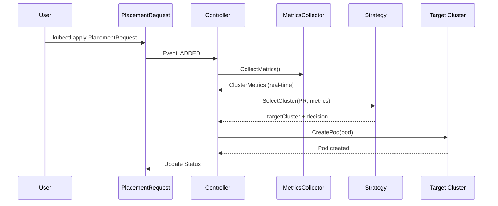

# Cloud Continuum Orchestrator - Fase 2

## Orchestrazione Multi-Cluster con Strategie di Placement e Metriche Reali

---

## Indice

- [Panoramica](#panoramica)
- [Obiettivi della Fase 2](#obiettivi-della-fase-2)
- [Architettura del Sistema](#architettura-del-sistema)
- [Componenti Implementati](#componenti-implementati)
- [Strategie di Placement](#strategie-di-placement)
- [Sistema di Metriche Reali](#sistema-di-metriche-reali)
- [Installazione e Setup](#installazione-e-setup)
- [Utilizzo](#utilizzo)
- [Testing e Validazione](#testing-e-validazione)
- [Troubleshooting](#troubleshooting)
- [Limitazioni Conosciute](#limitazioni-conosciute)
- [Prossimi Sviluppi](#prossimi-sviluppi)

---

## Panoramica

La Fase 2 del progetto Cloud Continuum Orchestrator introduce un sistema di orchestrazione intelligente che automatizza le decisioni di placement dei workload ML su un'infrastruttura multi-cluster distribuita geograficamente.

### Infrastruttura

Il sistema gestisce **3 cluster Kubernetes** interconnessi tramite Submariner:
```
┌─────────────────────┐     ┌─────────────────────┐     ┌─────────────────────┐
│  Edge Cluster 1     │     │  Edge Cluster 2     │     │  Cloud Cluster      │
│  (Imola)            │◄───►│  (Lugo)             │◄───►│  (Bologna)          │
│  192.168.151.81     │     │  192.168.151.82     │     │  192.168.151.94     │
│                     │     │                     │     │                     │
│  4 CPU, 8Gi RAM     │     │  4 CPU, 8Gi RAM     │     │  16 CPU, 32Gi RAM   │
│  K3s + Kubeflow     │     │  K3s + Kubeflow     │     │  K3s + Kubeflow     │
└─────────────────────┘     └─────────────────────┘     └─────────────────────┘
         │                           │                           │
         └───────────────────────────┴───────────────────────────┘
                      Submariner Network (IPsec/WireGuard)
```

### Cosa Fa

Invece di decidere manualmente su quale cluster eseguire un workload, l'utente dichiara **cosa vuole eseguire** e il sistema decide automaticamente **dove** eseguirlo, basandosi su:

- 📊 **Metriche reali** dei cluster (CPU, memoria disponibile)
- 📍 **Località dei dati** (data locality)
- 🌐 **Latenza di rete** tra cluster
- ⚙️ **Strategia di placement** selezionata

---

## Obiettivi della Fase 2

La Fase 2 aveva 4 obiettivi principali:

### ✅ 1. Custom Resource Definition (CRD)

Creare un'interfaccia dichiarativa di alto livello che astragga la complessità del multi-cluster.

**Risultato:** CRD `PlacementRequest` che permette agli utenti di specificare:
- Tipo di workload (training, inference, preprocessing)
- Requisiti di risorse (CPU, memoria, GPU)
- Località dei dati
- Strategia di placement preferita

### ✅ 2. Controller Multi-Cluster

Sviluppare un controller Kubernetes capace di gestire deployment su cluster multipli.

**Risultato:** `PlacementRequestReconciler` che:
- Monitora le richieste di placement
- Raccoglie metriche da tutti i cluster
- Applica strategie di decisione
- Crea pod fisicamente sui cluster remoti

### ✅ 3. Strategie di Placement Baseline

Implementare 3 strategie deterministiche come riferimento per future strategie ML-based.

**Risultato:** 
- Cloud-Only Strategy
- Data-Locality Strategy  
- Simple-Heuristic Strategy

### ✅ 4. Raccolta Metriche Reali

Sostituire i dati simulati con metriche effettive raccolte dall'infrastruttura.

**Risultato:** Sistema di metriche che:
- Raccoglie CPU/Memory da Metrics API
- Misura latenza cross-cluster
- Aggiorna in background ogni 30 secondi
- Usa caching intelligente

---

## Architettura del Sistema

### Componenti Principali
```
┌─────────────────────────────────────────────────────────────────┐
│                     PlacementRequest (CRD)                       │
│  Spec: workloadType, resourceRequirements, dataLocation, ...    │
│  Status: targetCluster, placementDecision, conditions           │
└───────────────────────────┬─────────────────────────────────────┘
                            │
                            ▼
┌─────────────────────────────────────────────────────────────────┐
│              PlacementRequestReconciler (Controller)             │
│                                                                   │
│  ┌──────────────────┐  ┌──────────────────┐  ┌───────────────┐│
│  │ Metrics Collector│  │ Placement        │  │ Cluster       ││
│  │ (Real-time)      │  │ Strategies       │  │ Manager       ││
│  └──────────────────┘  └──────────────────┘  └───────────────┘│
└───────────────────────────┬─────────────────────────────────────┘
                            │
         ┌──────────────────┼──────────────────┐
         ▼                  ▼                  ▼
    cloud_cluster    edge_cluster_1    edge_cluster_2
    (API Client)     (API Client)      (API Client)
         │                  │                  │
         ▼                  ▼                  ▼
    [Pod Created]     [Pod Created]     [Pod Created]
```

### Flusso di Esecuzione


---

## Componenti Implementati

### 1. PlacementRequest CRD

**File:** `api/v1alpha1/placementrequest_types.go`

Definisce la struttura della richiesta di placement:
```yaml
apiVersion: orchestrator.cloudcontinuum.io/v1alpha1
kind: PlacementRequest
metadata:
  name: my-ml-job
spec:
  workloadType: training              # training | inference | preprocessing
  placementStrategy: simple-heuristic # cloud-only | data-locality | simple-heuristic
  dataLocation: edge_cluster_1        # Dove risiedono i dati
  resourceRequirements:
    cpu: "2"
    memory: "4Gi"
    gpu: 0
  podSpec:
    image: tensorflow/tensorflow:latest
    command: ["python", "train.py"]
status:
  targetCluster: edge_cluster_1       # Dove è stato piazzato
  placementDecision: "..."            # Motivazione della scelta
  placementTime: "2025-11-29T..."
  conditions:
    - type: Placed
      status: True
      reason: PlacementSuccessful
```

**Validazioni OpenAPI:**
- `workloadType`: enum {training, inference, preprocessing}
- `placementStrategy`: enum {cloud-only, data-locality, simple-heuristic, rl-based}
- `resourceRequirements.cpu`: Kubernetes quantity (es. "2", "500m")
- `resourceRequirements.memory`: Kubernetes quantity (es. "4Gi", "2048Mi")

### 2. Controller (PlacementRequestReconciler)

**File:** `internal/controller/placementrequest_controller.go`

Il cuore del sistema. Implementa il loop di riconciliazione:
```go
func (r *PlacementRequestReconciler) Reconcile(ctx, req) (ctrl.Result, error) {
    // 1. Fetch PlacementRequest
    // 2. Check se già processato (idempotenza)
    // 3. Raccogli metriche dai cluster
    // 4. Seleziona strategia
    // 5. Esegui strategia → ottieni cluster target
    // 6. Crea pod sul cluster remoto
    // 7. Aggiorna status
}
```

**Caratteristiche:**
- ✅ Idempotente (può essere chiamato N volte senza side effects)
- ✅ Gestione errori robusta
- ✅ Logging dettagliato
- ✅ Fallback su metriche mock in caso di errore critico

### 3. ClusterManager

**File:** `internal/multicluster/manager.go`

Gestisce l'accesso a cluster multipli:
```go
type ClusterManager struct {
    ClusterClients map[string]client.Client
}
```

**Funzionalità:**
- Legge kubeconfig da Kubernetes Secret
- Crea client Kubernetes per ogni cluster
- Registra schemi (incluso Metrics API)
- Fornisce client appropriato per cluster target

**Sicurezza:**
- Kubeconfig salvati come Secret cifrati
- Permessi RBAC minimi necessari
- Nessuna esposizione in log

### 4. Metrics Collector

**File:** `internal/metrics/collector.go`

Sistema di raccolta metriche real-time:
```go
type RealMetricsCollector struct {
    config  *Config
    clients map[string]client.Client
    cache   *ClusterMetrics        // Cache con TTL
    
    // Background refresh ogni 30s
    stopChan chan struct{}
}
```

**Metriche Raccolte:**

| Metrica | Fonte | Scopo |
|---------|-------|-------|
| CPU Capacity/Used/Available | Metrics API (NodeMetrics) | Decisioni di placement |
| Memory Capacity/Used/Available | Metrics API (NodeMetrics) | Decisioni di placement |
| Latency cross-cluster | HTTP ping agli API server | Ottimizzazione località |
| Availability | Connettività cluster | Esclusione cluster down |

**Background Refresh:**
```
T0: Start()
  ↓
T0+0s: Refresh immediato → cache popolata
  ↓
T0+30s: Refresh automatico → cache aggiornata
  ↓
T0+60s: Refresh automatico → cache aggiornata
  ...
```

**Gestione Errori:**
- Se cluster non risponde → escluso dalle decisioni (Opzione A)
- Se cache scaduta → errore al controller → fallback su mock
- Retry automatico al prossimo ciclo

---

## Strategie di Placement

### 1. Cloud-Only Strategy

**File:** `internal/placement/cloud_only.go`
```go
func (s *CloudOnlyStrategy) SelectCluster(...) (string, string, error) {
    // Sempre cloud_cluster se disponibile
    return "cloud_cluster", "Always use cloud", nil
}
```

**Quando usarla:**
- Workload che richiedono GPU (se solo cloud le ha)
- Processi computazionalmente intensivi
- Quando semplicità > ottimizzazione

**Pro:**
- ✅ Massima semplicità
- ✅ Predicibilità
- ✅ Cluster potente garantito

**Contro:**
- ❌ Ignora data locality
- ❌ Sottoutilizza edge
- ❌ Possibile collo di bottiglia

### 2. Data-Locality Strategy

**File:** `internal/placement/data_locality.go`
```go
func (s *DataLocalityStrategy) SelectCluster(...) (string, string, error) {
    // Se specificato dataLocation, usa quel cluster
    if dataLocation != "" {
        return dataLocation, "Data locality", nil
    }
    // Altrimenti default a cloud
    return "cloud_cluster", "No data location", nil
}
```

**Quando usarla:**
- Preprocessing di grandi dataset
- Workload I/O-intensive
- Quando latency > compute power

**Pro:**
- ✅ Minimizza trasferimento dati
- ✅ Riduce latenza accesso dati
- ✅ Sfrutta parallelismo naturale

**Contro:**
- ❌ Può saturare cluster con dati
- ❌ Ignora disponibilità risorse
- ❌ Fallisce se cluster pieno

### 3. Simple-Heuristic Strategy

**File:** `internal/placement/simple_heuristic.go`
```go
func (s *SimpleHeuristicStrategy) SelectCluster(...) (string, string, error) {
    // 1. Prova data locality SE ha risorse
    if dataLocation != "" && hasResources(dataLocation) {
        return dataLocation, "Data + resources", nil
    }
    
    // 2. Altrimenti cluster con più CPU disponibile
    return findMaxAvailableCPU(), "Most CPU available", nil
}
```

**Quando usarla:**
- Scenari misti e variabili
- Quando non hai certezze
- Bilanciamento tra locality e load

**Pro:**
- ✅ Compromesso pragmatico
- ✅ Adattiva al carico
- ✅ Fallback automatico

**Contro:**
- ❌ Decisioni greedy (non ottimali long-term)
- ❌ Non considera costi trasferimento dati
- ❌ Può ignorare latenza rete

---

## Sistema di Metriche Reali

### Architettura Metriche
```
RealMetricsCollector
    │
    ├─► Background Goroutine (ogni 30s)
    │   │
    │   ├─► Parallel Collection da tutti i cluster
    │   │   ├─► cloud_cluster: NodeMetrics API
    │   │   ├─► edge_cluster_1: NodeMetrics API
    │   │   └─► edge_cluster_2: NodeMetrics API
    │   │
    │   ├─► Latency Measurement (HTTP ping)
    │   │
    │   └─► Update Cache (con timestamp)
    │
    └─► CollectMetrics() → Ritorna cache (se valida)
```

### Implementazione Raccolta CPU/Memory
```go
// 1. Query NodeList
nodeList := &corev1.NodeList{}
cli.List(ctx, nodeList)

// 2. Query NodeMetrics
nodeMetrics := &metricsv1beta1.NodeMetricsList{}
cli.List(ctx, nodeMetrics)

// 3. Aggrega
totalCPU := sum(node.Status.Capacity[CPU])
usedCPU := sum(nodeMetrics.Usage[CPU])
availableCPU := totalCPU - usedCPU
```

### Implementazione Misurazione Latenza
```go
// HTTP ping all'API server
start := time.Now()
cli.Get(ctx, "kube-system", &corev1.Namespace{})
latency := time.Since(start).Milliseconds()
```

**Nota:** Misura latenza control plane, non data plane. Sufficiente per decisioni di alto livello.

### Configurazione
```go
type Config struct {
    RefreshInterval time.Duration  // Default: 30s
    LatencyTimeout  time.Duration  // Default: 5s
    MetricsTimeout  time.Duration  // Default: 10s
    CacheTTL        time.Duration  // Default: 60s
}
```

---

## Installazione e Setup

### Prerequisiti

- **Go:** 1.23+
- **Kubebuilder:** 4.10+
- **kubectl:** Configurato con multi-cluster access
- **3 cluster K3s** con Submariner e Kubeflow
- **Metrics-server** installato su tutti i cluster

### Step 1: Clone e Build
```bash
cd ~/cloudcontinuum-orchestrator

# Installa dipendenze
go mod tidy

# Genera manifesti CRD
make manifests

# Compila
make build
```

### Step 2: Installa CRD
```bash
# Installa PlacementRequest CRD sul cluster
make install

# Verifica
kubectl get crd placementrequests.orchestrator.cloudcontinuum.io
```

### Step 3: Setup Secret Multi-Cluster
```bash
# Crea namespace
kubectl create namespace cloudcontinuum-system

# Crea Secret con kubeconfig
kubectl create secret generic cluster-kubeconfigs \
  --from-file=edge_cluster_1=~/.kube/multicluster/edge-cluster-1.yaml \
  --from-file=edge_cluster_2=~/.kube/multicluster/edge-cluster-2.yaml \
  --from-file=cloud_cluster=~/.kube/multicluster/cloud-cluster.yaml \
  -n cloudcontinuum-system

# Verifica
kubectl get secret cluster-kubeconfigs -n cloudcontinuum-system
```

### Step 4: Avvia Controller
```bash
# Modalità sviluppo (locale)
make run

# Output atteso:
# INFO  Starting real metrics collector  refreshInterval=30s  clusters=3
# INFO  Multi-cluster manager initialized  clusters=[...]
# INFO  Starting Controller
```

---

## Utilizzo

### Esempio 1: Training su Cloud
```bash
cat <<EOF | kubectl apply -f -
apiVersion: orchestrator.cloudcontinuum.io/v1alpha1
kind: PlacementRequest
metadata:
  name: mnist-training
spec:
  workloadType: training
  placementStrategy: cloud-only
  resourceRequirements:
    cpu: "4"
    memory: "8Gi"
  podSpec:
    image: tensorflow/tensorflow:latest
    command: ["python", "train.py"]
    args: ["--dataset", "mnist"]
EOF
```

**Risultato:** Pod creato su `cloud_cluster`

### Esempio 2: Preprocessing su Edge
```bash
cat <<EOF | kubectl apply -f -
apiVersion: orchestrator.cloudcontinuum.io/v1alpha1
kind: PlacementRequest
metadata:
  name: data-preprocessing
spec:
  workloadType: preprocessing
  placementStrategy: data-locality
  dataLocation: edge_cluster_1
  resourceRequirements:
    cpu: "2"
    memory: "4Gi"
  podSpec:
    image: python:3.9
    command: ["python", "preprocess.py"]
EOF
```

**Risultato:** Pod creato su `edge_cluster_1` (vicino ai dati)

### Esempio 3: Inference Adattivo
```bash
cat <<EOF | kubectl apply -f -
apiVersion: orchestrator.cloudcontinuum.io/v1alpha1
kind: PlacementRequest
metadata:
  name: model-inference
spec:
  workloadType: inference
  placementStrategy: simple-heuristic
  dataLocation: edge_cluster_2
  resourceRequirements:
    cpu: "1"
    memory: "2Gi"
  podSpec:
    image: mymodel:latest
    command: ["python", "serve.py"]
EOF
```

**Risultato:** Pod creato sul cluster con più risorse disponibili, preferendo `edge_cluster_2` se ha capacità

### Verifica Risultati
```bash
# Lista PlacementRequest
kubectl get placementrequests

# Dettaglio decisione
kubectl describe placementrequest mnist-training

# Verifica pod creato
kubectl get pods --context=cloud_cluster -l placement-request
```

---

## Testing e Validazione

### Test Automatico

Usa lo script fornito:
```bash
cd ~/cloudcontinuum-orchestrator
chmod +x test-real-metrics.sh
./test-real-metrics.sh
```

Lo script esegue:
1. ✅ Verifica prerequisiti
2. ✅ Raccoglie metriche dirette
3. ✅ Testa tutte e 3 le strategie
4. ✅ Test sotto carico
5. ✅ Cleanup e report

### Test Manuale

#### Test 1: Metriche Reali
```bash
# Verifica metriche dirette
kubectl top nodes --context=cloud_cluster
kubectl top nodes --context=edge_cluster_1
kubectl top nodes --context=edge_cluster_2

# Crea PlacementRequest
kubectl apply -f examples/test-simple.yaml

# Verifica decisione (contiene valori reali)
kubectl get placementrequest test-simple -o jsonpath='{.status.placementDecision}'
```

**Aspettative:** Valori di CPU disponibili diversi dai mock (3000/2500/12000)

#### Test 2: Placement Distribuito
```bash
# Crea 3 PlacementRequest con strategie diverse
kubectl apply -f examples/test-cloud.yaml
kubectl apply -f examples/test-edge1.yaml
kubectl apply -f examples/test-edge2.yaml

# Verifica distribuzione fisica
kubectl get pods --context=cloud_cluster -l placement-request
kubectl get pods --context=edge_cluster_1 -l placement-request
kubectl get pods --context=edge_cluster_2 -l placement-request
```

**Aspettative:** Pod fisicamente su cluster diversi

#### Test 3: Comportamento Sotto Carico
```bash
# Crea stress su edge_cluster_1
kubectl run stress --context=edge_cluster_1 \
  --image=polinux/stress --restart=Never \
  -- stress --cpu 2 --timeout 60s

# Attendi 10s
sleep 10

# Crea PlacementRequest verso edge_cluster_1
kubectl apply -f examples/test-heuristic-edge1.yaml

# Verifica dove è stato piazzato
kubectl get placementrequest test-heuristic-edge1 \
  -o jsonpath='{.status.targetCluster}'
```

**Aspettative:** Se edge_cluster_1 saturo, simple-heuristic sceglie altro cluster

---

## Troubleshooting

### Problema: Controller non si avvia

**Sintomo:**
```
ERROR  failed to initialize cluster manager
```

**Causa:** Secret kubeconfig non trovato o malformato

**Soluzione:**
```bash
# Verifica Secret
kubectl get secret cluster-kubeconfigs -n cloudcontinuum-system

# Se mancante, ricrealo
kubectl create secret generic cluster-kubeconfigs \
  --from-file=edge_cluster_1=~/.kube/multicluster/edge-cluster-1.yaml \
  --from-file=edge_cluster_2=~/.kube/multicluster/edge-cluster-2.yaml \
  --from-file=cloud_cluster=~/.kube/multicluster/cloud-cluster.yaml \
  -n cloudcontinuum-system
```

### Problema: Metriche non raccolte

**Sintomo:**
```
ERROR  Failed to collect metrics from cluster
ERROR  no kind is registered for the type v1beta1.NodeMetricsList
```

**Causa:** Scheme non registrato correttamente

**Soluzione:** Già risolto nel codice. Verifica che `internal/multicluster/manager.go` includa:
```go
import metricsv1beta1 "k8s.io/metrics/pkg/apis/metrics/v1beta1"
...
metricsv1beta1.AddToScheme(clusterScheme)
```

### Problema: PlacementRequest in stato Failed

**Sintomo:**
```
Status:
  Conditions:
    Status: False
    Reason: PlacementFailed
```

**Debugging:**
```bash
# Vedi decisione completa
kubectl describe placementrequest <name>

# Controlla log controller
# (nel terminale dove gira make run)

# Verifica metriche disponibili
kubectl top nodes --context=<target_cluster>
```

**Cause comuni:**
- Cluster target non raggiungibile
- Risorse insufficienti
- Strategia data-locality con cluster saturo

### Problema: Pod non creato su cluster remoto

**Sintomo:** PlacementRequest con Status=Placed ma pod non esiste

**Debugging:**
```bash
# Verifica cluster target
kubectl get placementrequest <name> -o jsonpath='{.status.targetCluster}'

# Cerca pod
kubectl get pods --context=<target_cluster> -n default -l placement-request

# Verifica RBAC
kubectl auth can-i create pods --context=<target_cluster>
```

---

## Limitazioni Conosciute

### 1. Cleanup Cross-Cluster

**Problema:** Quando un PlacementRequest viene cancellato, i pod remoti non vengono automaticamente rimossi.

**Motivo:** Kubernetes owner references funzionano solo nello stesso cluster.

**Workaround Attuale:** Cleanup manuale
```bash
kubectl delete pod <name>-pod --context=<cluster>
```

**Fix Futuro:** Implementare finalizers custom

### 2. Metriche Mock Fallback

**Problema:** Se tutti i cluster falliscono la raccolta metriche, il sistema usa valori mock.

**Motivo:** Garantire funzionamento anche con problemi temporanei.

**Mitigazione:** Monitorare log per errori di raccolta metriche.

### 3. Latenza Control Plane vs Data Plane

**Problema:** La latenza misurata è quella degli API server (control plane), non del traffico pod-to-pod (data plane).

**Impatto:** Metriche approssimative, non esatte.

**Accettabile per:** Decisioni di alto livello. Per ottimizzazioni fini servirebbero pod di test.

### 4. Nessun Feedback su Completamento Pod

**Problema:** Il controller non monitora se i pod completano con successo o falliscono.

**Impatto:** Status PlacementRequest non riflette stato pod.

**Fix Futuro:** Watch su pod creati e aggiornamento Status di conseguenza.

---

## Prossimi Sviluppi

### Fase 2.5: Benchmark e Analisi Performance

- ✅ Suite di test comparativi tra strategie
- ✅ Metriche di performance (latenza, throughput)
- ✅ Identificazione punti deboli delle euristiche

### Fase 3: Reinforcement Learning

- 🔄 Implementazione agente PPO
- 🔄 Training su dataset raccolto dalle strategie baseline
- 🔄 Integrazione strategia RL-based
- 🔄 Confronto RL vs euristiche

### Miglioramenti Pianificati

- **Finalizers:** Cleanup automatico cross-cluster
- **Pod Monitoring:** Feedback su stato esecuzione
- **Metriche Avanzate:** Data plane latency, I/O throughput
- **Dashboard:** UI per visualizzare decisioni e metriche
- **Kubeflow Integration:** Orchestrazione pipeline complete

---

## Riferimenti

### Documentazione

- [Kubernetes Custom Controllers](https://kubernetes.io/docs/concepts/extend-kubernetes/api-extension/custom-resources/)
- [Kubebuilder Book](https://book.kubebuilder.io/)
- [Metrics API](https://github.com/kubernetes-sigs/metrics-server)
- [Submariner Documentation](https://submariner.io/)

### File Chiave
```
cloudcontinuum-orchestrator/
├── api/v1alpha1/
│   └── placementrequest_types.go       # CRD definition
├── internal/
│   ├── controller/
│   │   └── placementrequest_controller.go  # Main controller
│   ├── multicluster/
│   │   └── manager.go                  # Multi-cluster client manager
│   ├── placement/
│   │   ├── types.go                    # Strategy interface
│   │   ├── cloud_only.go              # Strategy 1
│   │   ├── data_locality.go           # Strategy 2
│   │   └── simple_heuristic.go        # Strategy 3
│   └── metrics/
│       ├── types.go                    # Metrics types
│       └── collector.go                # Real metrics collector
├── config/crd/bases/
│   └── orchestrator.cloudcontinuum.io_placementrequests.yaml
└── test-real-metrics.sh               # Test automation script
```

### Comandi Utili
```bash
# Build
make build

# Install CRD
make install

# Run controller
make run

# Test
./test-real-metrics.sh

# Cleanup
kubectl delete placementrequest --all
make uninstall
```

---

## Conclusioni

La Fase 2 ha trasformato il Cloud Continuum Orchestrator da un'infrastruttura passiva a un sistema attivo e intelligente capace di:

✅ Prendere decisioni automatizzate di placement  
✅ Utilizzare metriche reali dell'infrastruttura  
✅ Distribuire fisicamente workload su cluster geograficamente separati  
✅ Adattarsi dinamicamente al carico dei cluster  

Il sistema fornisce una base solida per la Fase 3, dove le strategie deterministiche verranno sostituite da un agente di Reinforcement Learning capace di apprendere politiche ottimali dall'esperienza.

---

**Autore:** Max Allegri  
**Data:** Novembre 2025  
**Versione:** 2.0  
**Licenza:** Apache 2.0